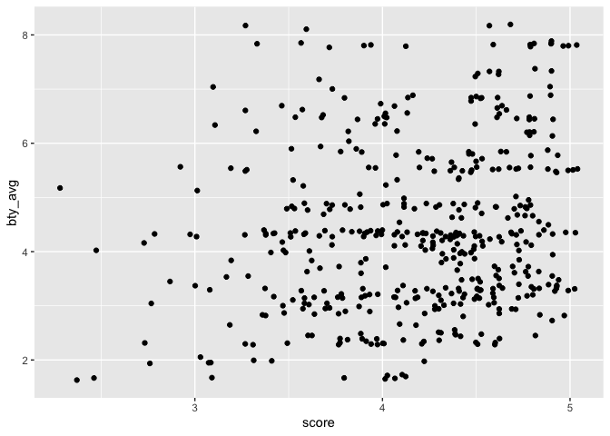

Lab 09
================
Conor Lacey
2023-03-17

### Libraries

``` r
suppressWarnings(library(tidyverse))
```

    ## ── Attaching packages ─────────────────────────────────────── tidyverse 1.3.2 ──
    ## ✔ ggplot2 3.4.0     ✔ purrr   0.3.4
    ## ✔ tibble  3.1.8     ✔ dplyr   1.0.8
    ## ✔ tidyr   1.1.4     ✔ stringr 1.4.0
    ## ✔ readr   2.1.3     ✔ forcats 0.5.1
    ## ── Conflicts ────────────────────────────────────────── tidyverse_conflicts() ──
    ## ✖ dplyr::filter() masks stats::filter()
    ## ✖ dplyr::lag()    masks stats::lag()

``` r
suppressWarnings(library(broom))
suppressWarnings(library(openintro))
```

    ## Loading required package: airports
    ## Loading required package: cherryblossom
    ## Loading required package: usdata

### Exercise 1

``` r
evals %>% ggplot(aes(x = score)) +
  geom_density(fill = "blue", alpha = 0.5)
```

<!-- -->

``` r
summary(evals$score)
```

    ##    Min. 1st Qu.  Median    Mean 3rd Qu.    Max. 
    ##   2.300   3.800   4.300   4.175   4.600   5.000

In general students rate courses pretty high. However, there it is
skewed to the left. I would expect this as much, given that most
students will do well in a class, getting a B or above and hence will
give the professor a good rating. However, a few students will do
exteremly poor in the class and hence blame some of their poor behavior
on the professor.

### Exercise 2

``` r
evals %>% ggplot(aes(x = score, y = bty_avg)) + 
  geom_point() 
```

<!-- -->

In general, the relationship between score and beauty average appears to
be random.

``` r
cor(evals$score,evals$bty_avg)
```

    ## [1] 0.1871424

Sure enough. The correlation is very small.

### Exercise 3

``` r
evals %>% ggplot(aes(x = score, y = bty_avg)) + 
  geom_jitter() 
```

<!-- -->

Jitter here is adding a little bit of random variation to the location
of each point. This helps in that the initial plot isn’t doing this
because the score variable is a discrete variable. What’s misleading
about the initial plot is that it assumes that there is no random
variation when someone gives one particular score. Just because someone
may give a score of 4 doesn’t mean that their following the same
criteria as someone else also giving that 4. Everyone gives that 4 for
slightly different reasons. Jitter helps to communicate this.

### Exercise 4

``` r
m_bty <- lm(evals$score ~ evals$bty_avg)
summary(m_bty)
```

    ## 
    ## Call:
    ## lm(formula = evals$score ~ evals$bty_avg)
    ## 
    ## Residuals:
    ##     Min      1Q  Median      3Q     Max 
    ## -1.9246 -0.3690  0.1420  0.3977  0.9309 
    ## 
    ## Coefficients:
    ##               Estimate Std. Error t value Pr(>|t|)    
    ## (Intercept)    3.88034    0.07614   50.96  < 2e-16 ***
    ## evals$bty_avg  0.06664    0.01629    4.09 5.08e-05 ***
    ## ---
    ## Signif. codes:  0 '***' 0.001 '**' 0.01 '*' 0.05 '.' 0.1 ' ' 1
    ## 
    ## Residual standard error: 0.5348 on 461 degrees of freedom
    ## Multiple R-squared:  0.03502,    Adjusted R-squared:  0.03293 
    ## F-statistic: 16.73 on 1 and 461 DF,  p-value: 5.083e-05

Linear model is:

score = 3.88 + .067\*bty_avg.

### Exercise 5

``` r
evals %>% ggplot(aes(x = score, y = bty_avg)) + 
  geom_jitter() + 
  stat_smooth(method = lm, se = FALSE, color = "orange")
```

    ## `geom_smooth()` using formula = 'y ~ x'

<!-- -->

### Exercise 6

Given the linear model, there is a positive relationship between score
and beauty average such that as score increases so does beauty average.

### Exercise 7

The intercept is 3.88 which means that with a score of 0 the mean
average beauty rating is 3.88. I guess this would make sense. This is a
relatively low score and I assume that those who do not do well in a
class may hold animosity towards their professors such that they give
them low beauty ratings.

### Exercise 8

The R^2 value is 0.035 meaning 3.5% of the variance in average beauty
ratings can be explained by a professor’s average evaluation score.

### Exercise 9

``` r
m_gen <- lm(evals$score ~ evals$gender)
summary(m_gen)
```

    ## 
    ## Call:
    ## lm(formula = evals$score ~ evals$gender)
    ## 
    ## Residuals:
    ##      Min       1Q   Median       3Q      Max 
    ## -1.83433 -0.36357  0.06567  0.40718  0.90718 
    ## 
    ## Coefficients:
    ##                  Estimate Std. Error t value Pr(>|t|)    
    ## (Intercept)       4.09282    0.03867 105.852  < 2e-16 ***
    ## evals$gendermale  0.14151    0.05082   2.784  0.00558 ** 
    ## ---
    ## Signif. codes:  0 '***' 0.001 '**' 0.01 '*' 0.05 '.' 0.1 ' ' 1
    ## 
    ## Residual standard error: 0.5399 on 461 degrees of freedom
    ## Multiple R-squared:  0.01654,    Adjusted R-squared:  0.01441 
    ## F-statistic: 7.753 on 1 and 461 DF,  p-value: 0.005583

The linear model is:

score = .14\*gender + 4.09

The intercept indicates that female professors earn an average
evaluation score of 4.09. The slope indicates that if a professor is
male the average evaluation score is .14 more than the female average
evaluation score.

### Exercise 10

Equation for females:

score = 4.09

Equation for males:

score = 4.23

### Exercise 11

``` r
m_rank <- lm(evals$score ~ evals$rank)
summary(m_rank)
```

    ## 
    ## Call:
    ## lm(formula = evals$score ~ evals$rank)
    ## 
    ## Residuals:
    ##     Min      1Q  Median      3Q     Max 
    ## -1.8546 -0.3391  0.1157  0.4305  0.8609 
    ## 
    ## Coefficients:
    ##                        Estimate Std. Error t value Pr(>|t|)    
    ## (Intercept)             4.28431    0.05365  79.853   <2e-16 ***
    ## evals$ranktenure track -0.12968    0.07482  -1.733   0.0837 .  
    ## evals$ranktenured      -0.14518    0.06355  -2.284   0.0228 *  
    ## ---
    ## Signif. codes:  0 '***' 0.001 '**' 0.01 '*' 0.05 '.' 0.1 ' ' 1
    ## 
    ## Residual standard error: 0.5419 on 460 degrees of freedom
    ## Multiple R-squared:  0.01163,    Adjusted R-squared:  0.007332 
    ## F-statistic: 2.706 on 2 and 460 DF,  p-value: 0.06786

The regression model is:

score = 4.28 + tenture_track*-.13 + tenured*-.16

The intercept indicates that the mean average teaching professor score
is 4.28. The slope of tenure_track indicates that that mean average
tenture track professor score is 4.28-.13, or 4.15. Lastly, the slope of
tentured indicates that the mean average tenured professor score is
4.28 - .16, or 4.12.

### Exercise 12

``` r
evals <- evals %>% mutate(rank_relevel = case_when(rank == "tenure track" ~ 0,
                                          rank == "teaching" ~ 1,
                                          rank == "tenured" ~ 2))
```

### Exercise 13

``` r
m_rank_relevel <- lm(evals$score ~ evals$rank_relevel)
summary(m_rank_relevel)
```

    ## 
    ## Call:
    ## lm(formula = evals$score ~ evals$rank_relevel)
    ## 
    ## Residuals:
    ##     Min      1Q  Median      3Q     Max 
    ## -1.9032 -0.3599  0.1185  0.4185  0.8401 
    ## 
    ## Coefficients:
    ##                    Estimate Std. Error t value Pr(>|t|)    
    ## (Intercept)         4.20317    0.04751  88.463   <2e-16 ***
    ## evals$rank_relevel -0.02166    0.03063  -0.707     0.48    
    ## ---
    ## Signif. codes:  0 '***' 0.001 '**' 0.01 '*' 0.05 '.' 0.1 ' ' 1
    ## 
    ## Residual standard error: 0.5442 on 461 degrees of freedom
    ## Multiple R-squared:  0.001084,   Adjusted R-squared:  -0.001083 
    ## F-statistic:   0.5 on 1 and 461 DF,  p-value: 0.4798

The linear model is:

score = 4.2 + rank_relevel\*-0.02

In this linear model the intercept indicates that the mean average
tenure track professor score is 4.2. The slope of rank_level indicates
that mean average teaching professor score is 4 and the mean average
tenured professor score is 3.98.

The R^2 value is 0.001 meaning the the rank_relevel variable explains
0.1% of the of the variance in average professor evaluation scores.

### Exercise 14

``` r
evals <- evals %>% mutate(tenure_eligible = if_else(rank == "tenure track" | rank == "tenured", 
                                                    "yes", "no"))
```

### Exercise 15
