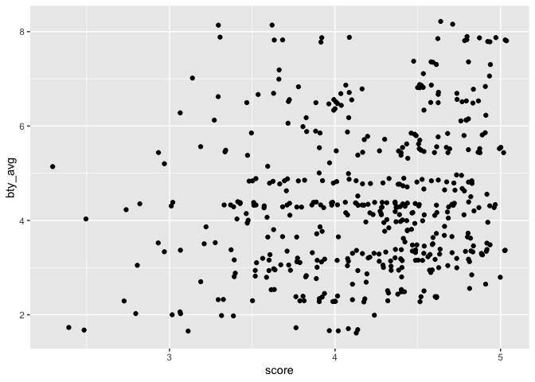

Lab 09
================
Conor Lacey
2023-03-17

### Libraries

``` r
library(tidyverse) 
```

    ## Warning: package 'tidyverse' was built under R version 4.1.2

    ## ── Attaching packages ─────────────────────────────────────── tidyverse 1.3.2 ──
    ## ✔ ggplot2 3.4.0     ✔ purrr   0.3.4
    ## ✔ tibble  3.1.8     ✔ dplyr   1.0.8
    ## ✔ tidyr   1.1.4     ✔ stringr 1.4.0
    ## ✔ readr   2.1.3     ✔ forcats 0.5.1

    ## Warning: package 'ggplot2' was built under R version 4.1.2

    ## Warning: package 'tibble' was built under R version 4.1.2

    ## Warning: package 'readr' was built under R version 4.1.2

    ## Warning: package 'dplyr' was built under R version 4.1.2

    ## ── Conflicts ────────────────────────────────────────── tidyverse_conflicts() ──
    ## ✖ dplyr::filter() masks stats::filter()
    ## ✖ dplyr::lag()    masks stats::lag()

``` r
library(broom)
```

    ## Warning: package 'broom' was built under R version 4.1.2

``` r
library(openintro)
```

    ## Warning: package 'openintro' was built under R version 4.1.2

    ## Loading required package: airports
    ## Loading required package: cherryblossom
    ## Loading required package: usdata

``` r
library(skimr)
```

    ## Warning: package 'skimr' was built under R version 4.1.2

### Exercise 1

``` r
evals %>% ggplot(aes(x = score)) +
  geom_density(fill = "blue", alpha = 0.5)
```

<!-- -->

``` r
summary(evals$score)
```

    ##    Min. 1st Qu.  Median    Mean 3rd Qu.    Max. 
    ##   2.300   3.800   4.300   4.175   4.600   5.000

In general students rate courses pretty high. However, there it is
skewed to the left. I would expect this as much, given that most
students will do well in a class, getting a B or above and hence will
give the professor a good rating. However, a few students will do
exteremly poor in the class and hence blame some of their poor behavior
on the professor.

### Exercise 2

``` r
evals %>% ggplot(aes(x = score, y = bty_avg)) + 
  geom_point() 
```

<!-- -->

In general, the relationship between score and beauty average appears to
be random.

``` r
cor(evals$score,evals$bty_avg)
```

    ## [1] 0.1871424

Sure enough. The correlation is very small.

### Exercise 3

``` r
evals %>% ggplot(aes(x = score, y = bty_avg)) + 
  geom_jitter() 
```

<!-- -->

Jitter here is adding a little bit of random variation to the location
of each point. This helps in that the initial plot isn’t doing this
because the score variable is a discrete variable. What’s misleading
about the initial plot is that it assumes that there is no random
variation when someone gives one particular score. Just because someone
may give a score of 4 doesn’t mean that their following the same
criteria as someone else also giving that 4. Everyone gives that 4 for
slightly different reasons. Jitter helps to communicate this.
